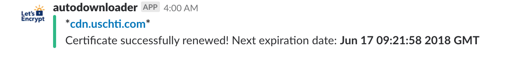

# Let's encrypt Godaddy DNS renew Docker container
Renew your Let's encrypt certificate by using the DNS validation procedure.
This Docker container works with the **Godaddy DNS API** and send a **Slack** notification with the execution result.

**Slack notification example**


## Usage with docker-compose.yml
```
docker-compose up
```


## Usage with standard docker command
### Create the **cert-data** volume first:
```
docker volume create cert-data
```

### Run the docker container
```
docker container run --rm -e GD_KEY: someMagicKey \
-e GD_SECRET: theCorrespondingSecret \
-e SLACK_URL: https://hooks.slack.com/services/XXXXXXXXXXX \
-e SLACK_DOMAIN_TITLE: yourdomain.com \
-v /data/certs:/data/certs \
-v /data/keys:/data/keys \
-v renew_certificates.conf:/data/letsencrypt/renew_certificates.conf \
-v cert-data:/data/letsencrypt/dehydrated/certs \
uschti/le-godaddy-dns
```

## Input parameters explanation
### Environment variables
- **GD_KEY**:					Godaddy AIPI Key
- **GD_SECRET**:				Godaddy API Secret
> Generate new Keys at: https://developer.godaddy.com/keys

- **SLACK_URL**:				Slack incoming webhook URL
- **SLACK_DOMAIN_TITLE**:		Slack title (to easily identify the domain)

### Volumes
- **/data/certs**:				Folder where the created certificate will be copied (example of created file: yourdomain.com.crt)
- **/data/keys**:					Folder where the created key will be copied (example of created file: yourdomain.com.key)
- **renew_certificates.conf**: 	Config file with the list of domains you want create the certificate
- **cert-data**:					Volume where the container store the created certificates and keys. This mounting avoid to create a new certificate each time the container run; with the configuration a new certificate will be created only of the certificate expiration is less than 1 month

## References
[Godaddy DNS renewal](https://github.com/josteink/le-godaddy-dns)
[Docker](https://docs.docker.com/)

## Disclaimer
This module is not affiliated with nor endorsed by Godaddy. The Godaddy API python-modules are not affiliated with nor endorsed by Godaddy.

This module is not affiliated with nor endorsed by Let's Encrypt.

This docker container is provided as is and comes with absolutely NO warranties and I take absolutely NO responsibility should an error resulting from using this script wipe out your DNS and get your Godaddy account terminated.

Bugs in dependant Python-modules have resulted in data-loss for the author, and while the currently published code only uses code proven to be safe at time of writing, I can make no guarantees about how things may or may not work in the future.

Testing the module on a test-domain where you can afford downtime is definitely recommended.

That said, it all works for me.
